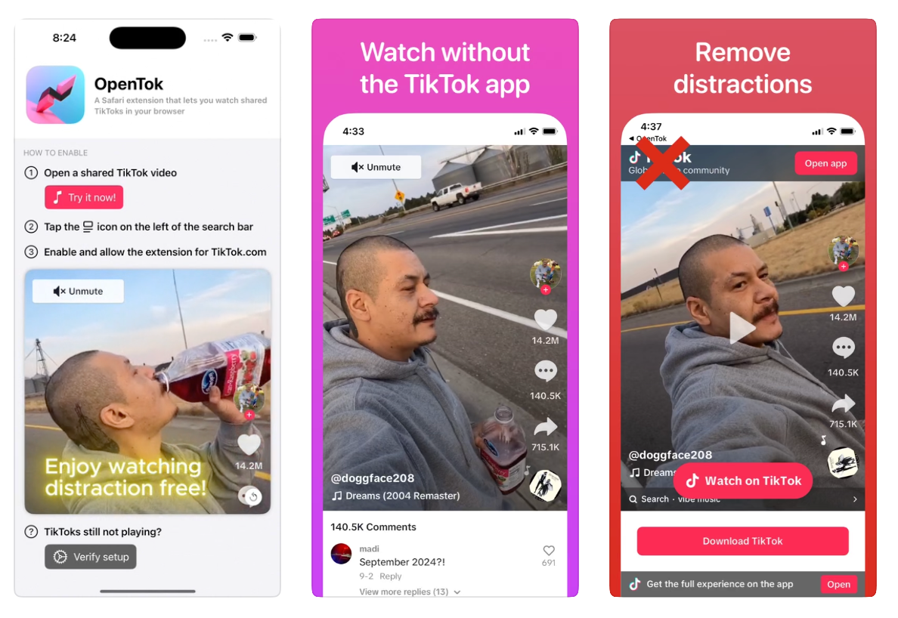

# OpenTok

OpenTok brings back the ability to watch shared TikToks in your browser.

With TikTok's recent changes, trying to watch videos directly in the browser has become a hassle. OpenTok solves this by stripping tracking details from shared TikTok links, allowing you to watch videos without ever installing the TikTok app. It also cleans up the page for a distraction free viewing experience.

A special thanks to Christian Selig for giving permission to reuse his custom video player (`OpenTok/VideoExplainerView.swift`). Amplosion was a big inspiration for this project.

---

If you are curious to explore, the app itself is written in SwiftUI and serves as a guide on how to enable the extension. You can find the top level views defined in `OpenTok/ContentView.swift`.

The core _functionality_ of OpenTok is packaged within its extension. You can find the following in `OpenTok Extension/Resources/`:
- `content.js`: This performs the redirect that fixes the video links (using the solution found [here](https://www.reddit.com/r/Tiktokhelp/comments/1cxeaf6/comment/l5cmpow/?utm_source=share&utm_medium=web3x&utm_name=web3xcss&utm_term=1&utm_content=share_button)). It simply trims off the query parameters.
- `content.css`: This defines the styles that hide the banners and popups on the page. My goal was to get rid of any element that interfered with viewing or that redirected you to download the app.

Hope you enjoy!